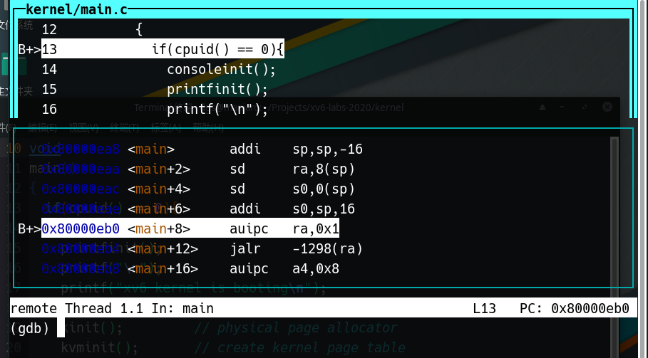

# 				GUN Debugger

## 1. 启动

+ 目录下的**.gdbinit**文件用于自动设置GDB（当我们在该目录下运行gdb时），但需要先按要求编辑**~/.gdbinit**以执行该GDB初始化
+ 以带有或不带有GDB的方式使用`make`指令启动QEMU
  + 带有GDB：运行r`make qemu[-nox]-gdb`，然后在第二个Shell中启动GDB（`riscv64-linux-gnu-gdb`）或（`gdb`）
  + 如果以**单核**方式启动，则使用`make CPUS=1 qemu-gdb`
  + 不带有GDB：当不需要GDB时使用`make qemu[-nox]`命令

## 2.GDB命令

+ `help <命令名称>`：用来获取帮助
+ **指令可以被简写**，无歧义时：`c`=`co`=`cont`=`continue`
+ 一些额外的简写已经被定义:`s`=`step` 以及 `si`=`stepi`

## 3. 单步调试

+ `next`:一次运行一行代码。但当有函数调用时，它**不会**进入该函数。
+ `step`:一次运行一行代码。当有函数调用时，它将**步进**到被调用的对象函数。
+ `stepi`和`nexti`对于**汇编指令**是单步调试。

## 4. 运行调试

+ `continue`:运行代码，**直到遇到断点**或使用`<Ctrl-c>`中断它
+ `finish`:运行代码，直到**当前函数**返回
+ `advance <location>`:运行代码，直到指令指针**到达指定位置**

## 5. 断点

+ `break <location>`:

  在指定的位置设置断点。 位置可以是内存地址(***0x7c00**)或名称(**monbacktrace**，**monitor.c:71**)

+ 如需修改断点请使用`delete`，`disable`，`enable`

## 6. 条件断点

+ `break <location> if <condition>`：在指定位置设置断点，但仅在满足条件时中断。
+ `cond <断点的number> <condition>`：在现有断点上添加条件。

## 7. 监视点

类似于断点，但条件更为复杂。

+ `watch <expression>`：每当表达式的值更改时，将停止执行

+ `watch -l <address>`:每当指定内存地址的内容发生变化时，就会停止执行。

  命令`wa var`和`wa -l &var`有什么不同呢????

+ `rwatch [-l] <expression>`:将在**读取**表达式的值时停止执行。

## 8.  检查命令

- `x`:以您指定格式（`x/x`表示十六进制，`x/i`表示汇编，等等）打印内存的原始内容。
- `print`/`p`:计算一个C表达式并将结果以合适的类型打印。它通常比`x`更有用.
- 使用`p *((struct elfhdr *) 0x10000)`的输出比`x/13x 0x10000`的输出好得多.

## 9.  其他检查命令

+ `info registers/reg`:打印每个寄存器的值
+ `info frame`: 打印当前栈帧
+ `list <location>`:在指定位置打印函数的**源代码**
+ `backtrace`:或许对于你的lab1中的工作很有用处(回溯)

## 10. 布局

GDB有一个文本用户界面，在curses用户界面中显示有用的信息，如代码列表、反汇编和寄存器内容。

+ `layout <name>`：切换到给定的用户界面。

  例如`layout split`，效果如下：

  

## 11. 其他技巧

+ 你可以使用`set`命令在执行期间更改变量的值。

+ 你必须切换符号文件才能获得除内核以外环境的函数和变量名。例如，当调试JOS时：

  ```
  symbol-file obj/user/<name>
  symbol-file obj/kern/kernel
  ```

  > 符号文件（Symbol Files）是一个数据信息文件，它包含了应用程序二进制文件（比如：EXE、DLL等）调试信息，**专门用来作调试之用，最终生成的可执行文件在运行时并不需要这个符号文件**，但你的程序中所有的**变量信息**都记录在这个文件中。所以调试应用程序时，这个文件是非常重要的。用 Visual C++ 和 WinDbg 调试程序时都要用到这个文件。

## 12. 其他

+ `layout asm`：查看汇编 
+ `layout reg`：查看寄存器 
+ `info reg`：查看寄存器 
+ `b *0x1234`：在指定地址设定断点

## QEMU相关

`Ctrl+a c`：进入控制模式。

`Ctrl+a x`: 退出。

 `info mem`：打印页表。


